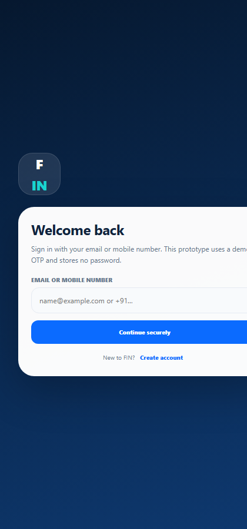
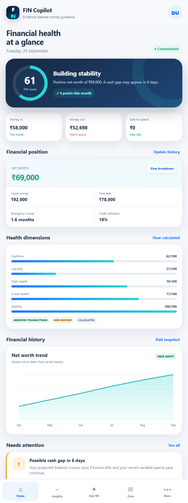
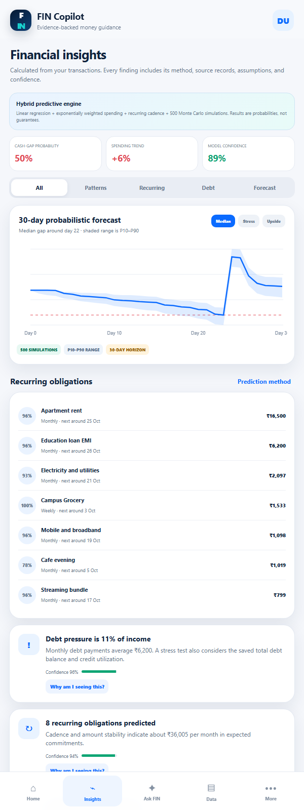
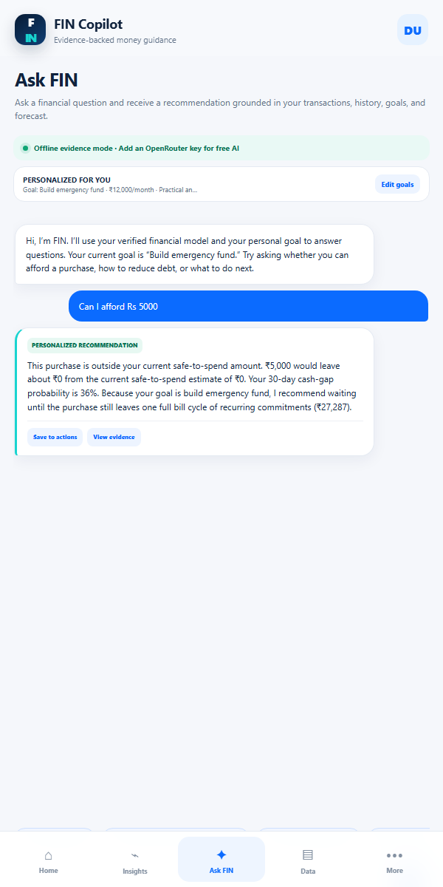
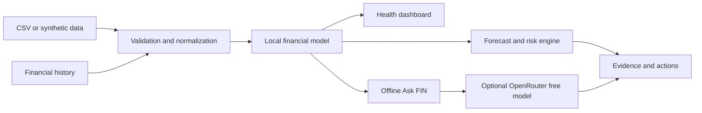

# FIN - Financial Health Copilot

<p align="center">
  <strong>An explainable, privacy-conscious Android copilot for understanding money today and planning for what comes next.</strong>
</p>

<p align="center">
  
  
  
  
</p>

FIN turns consented transaction and financial-history data into a consolidated health view, probabilistic cash-flow forecasts, explainable risk signals, and personalized conversations. The core experience works offline; users may optionally connect an OpenRouter free-model API key at runtime.

<p align="center">
  <a href="https://github.com/AnantHejib/HACKMATRIX-5.0/releases/latest"><strong>Download the latest APK</strong></a>
  &nbsp;|&nbsp;
  <a href="docs/DEMO_GUIDE.md">Run the demo</a>
  &nbsp;|&nbsp;
  <a href="docs/ARCHITECTURE.md">Explore the architecture</a>
</p>

## Product preview

<table>
  <tr>
    <td align="center"><br><strong>Secure demo login</strong></td>
    <td align="center"><br><strong>Financial-health overview</strong></td>
  </tr>
  <tr>
    <td align="center"><br><strong>Predictive insights</strong></td>
    <td align="center"><br><strong>Personalized Ask FIN</strong></td>
  </tr>
</table>

## Expected outputs delivered

| Expected output | FIN implementation |
| --- | --- |
| Consolidated financial-health view | Combines transactions, balances, debt, credit utilization, savings, income, and history into one explainable dashboard. |
| Spending and obligation analysis | Detects category trends, recurring commitments, anomalies, debt pressure, and safe-to-spend capacity. |
| Future cash-flow gaps | Runs 500 reproducible Monte Carlo paths and reports median, stress (P10), upside (P90), and gap probability. |
| Conversational financial guidance | Answers in offline evidence mode or through an optional free-model OpenRouter connection, using the current financial model and user goals. |
| Login and analysis system | Includes passwordless demo OTP login, local sessions, CSV validation, a seven-stage analysis workspace, evidence records, and an audit trail. |

## Core capabilities

- Consent-first onboarding with a synthetic demo dataset
- Passwordless local prototype login and persistent on-device sessions
- Net worth, cash flow, savings rate, emergency runway, debt pressure, and credit utilization
- Editable financial history and month-by-month net-worth tracking
- CSV import with validation, duplicate checks, coverage scoring, and anomaly detection
- Spending-pattern analysis using ordinary least squares and exponentially weighted averages
- Recurring-obligation detection using median cadence and consistency confidence
- 30-day probabilistic balance forecast with uncertainty bands
- Personalized affordability, emergency-fund, debt-payoff, and spending-reduction recommendations
- Correctable categories and immediate model recalculation
- Recommendation action center with accept, complete, and dismiss feedback
- Optional AI responses without embedding any provider key in the APK

## How prediction works

FIN uses transparent statistical methods rather than presenting a black-box score:

1. Monthly spending trend is estimated with ordinary least squares.
2. Recent behavior is weighted with an EWMA using `alpha = 0.35`.
3. Recurring payments require at least three matching events and are scored from interval and amount consistency.
4. Debt pressure combines debt service, total debt, income, and revolving-credit utilization.
5. The next 30 days are simulated across 500 deterministic-seed Monte Carlo paths.
6. Every major result includes its method, assumptions, confidence, source records, and limitations.

See [Data model and analytics](docs/DATA_MODEL.md) for definitions and formulas.

## Architecture



The APK is a compact native Android shell around a local WebView application. Android handles file selection and device integration; the embedded interface performs analytics and stores prototype data locally. See [Architecture](docs/ARCHITECTURE.md) for the full flow.

## Install and demo

1. Download [`FIN-Financial-Copilot-v1.4.0.apk`](https://github.com/AnantHejib/HACKMATRIX-5.0/releases/download/v1.4.0/FIN-Financial-Copilot-v1.4.0.apk).
2. Install it on Android 7.0 or newer. Android may ask you to allow installs from your file manager.
3. Enter any valid email address or 10-15 digit mobile number.
4. Use demo OTP `246810`.
5. Choose **Explore demo data** for the fastest guided experience.

Full presentation steps are in the [demo guide](docs/DEMO_GUIDE.md).

## Import your own CSV

```csv
date,description,amount,category,type
2026-09-01,Campus stipend,58000,Income,income
2026-09-02,Apartment rent,-16500,Housing,expense
```

Dates use `YYYY-MM-DD`. Expenses can use negative amounts or `type=expense`. Imported data remains on the device.

## Optional AI connection

Open **More > AI settings** and provide an OpenRouter key. FIN uses `openrouter/free`; the key is supplied at runtime and is never embedded in the APK. Only the user's question and a short calculated summary are sent, not raw transaction rows. Without a key, Ask FIN remains usable in offline evidence mode.

## Build from source

Requirements: JDK 17+ and Android SDK 35.

```bash
gradle assembleDebug
```

The debug APK is written to `app/build/outputs/apk/debug/app-debug.apk`. GitHub Actions also builds a downloadable debug artifact for every change to `main` and every pull request.

## Repository map

```text
app/src/main/assets/index.html                 UI and financial analytics
app/src/main/java/com/ctrlaltelite/fin/       Android host and CSV picker
docs/                                         Architecture, model, and demo notes
.github/workflows/android.yml                 Reproducible Android CI build
FIN_Financial_Health_Copilot_...pptx          Original hackathon presentation
```

## Privacy and limitations

FIN is an educational hackathon prototype, not investment, lending, credit, tax, or legal advice. Authentication is a local demo flow, not production identity verification. Forecasts are estimates based on available data and should be reviewed alongside real account information.

Security and responsible disclosure details are in [SECURITY.md](SECURITY.md).

## Team

- Gauri Deshpande
- Nehali Shelar
- Anant Hejib
