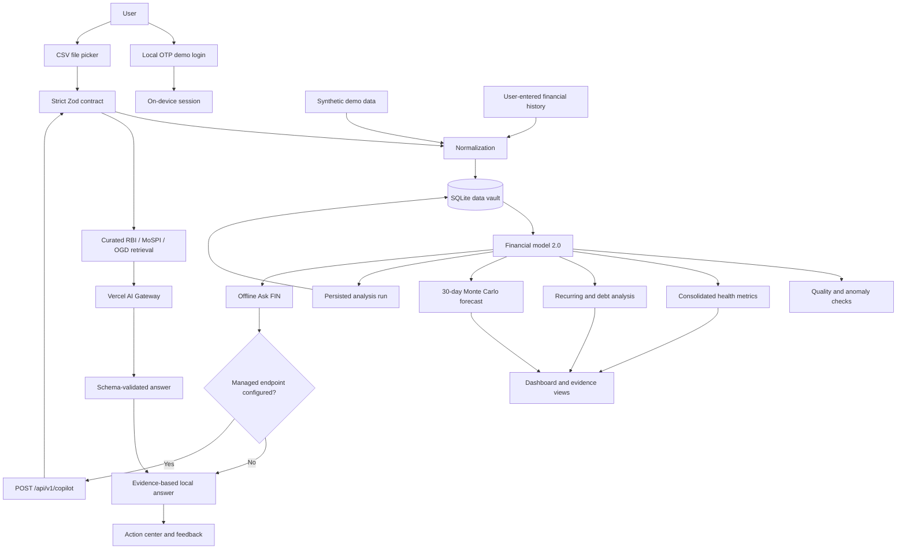

# FIN architecture

FIN is intentionally compact: an Android host provides device integration and durable SQLite storage while an embedded local application renders the interface and evaluates the financial model.

## Runtime flow

## Components

| Component | Responsibility |
| --- | --- |
| `MainActivity.java` | Hosts the WebView, restricts navigation to bundled assets, registers the database bridge, and opens the Android document picker. |
| `FinDatabaseHelper.java` | Owns schema creation, validation, transactions, profile/history persistence, and the capped analysis audit log. |
| `FinDatabaseBridge.java` | Exposes narrow JSON database operations to the bundled interface. |
| `index.html` | Contains the responsive interface, deterministic analytics, forecast engine, and conversation logic. |
| `api/v1/copilot.js` | Accepts a versioned, bounded summary and returns a structured explainable answer. |
| `lib/contracts.js` | Enforces input/output schemas, size limits, confidence fields, and decision-layer separation. |
| `lib/copilot-service.js` | Retrieves curated guidance and invokes the environment-selected AI Gateway model. |
| Android resources | Define the launcher icon, theme, app label, and platform configuration. |
| GitHub Actions | Builds a clean debug APK for pushes and pull requests. |

## Data boundaries

- Transactions, financial profile/history, and analysis snapshots are stored in app-private SQLite. Existing local prototype records are migrated on first launch.
- Preferences, correction counters, chat history, and the demo session remain in WebView local storage.
- Android backup is disabled so the financial database is not copied through the platform backup service.
- No AI provider key is bundled in source code or the APK. Vercel deployments use OIDC; local development can use an AI Gateway key in `.env.local`.
- Copilot calls contain the question, recent conversation, preferences, calculated facts, predictions, precomputed recommendation impacts, and the latest before/after snapshot. They exclude raw transaction rows and merchant descriptions.
- The language model cannot author authoritative financial values: the prompt and output schema constrain it to explaining the deterministic local model.
- Cleartext traffic is disabled in the Android manifest.

## Design trade-offs

This release provides a deployable Copilot service boundary, but it is not yet a production identity or banking system. Before accepting real financial data, add server-verified identity, device-bound secure tokens, Vercel Firewall rate limits, user-controlled export/deletion, database encryption where required, automated migration tests, Android instrumentation, threat modeling, and independent security review.

