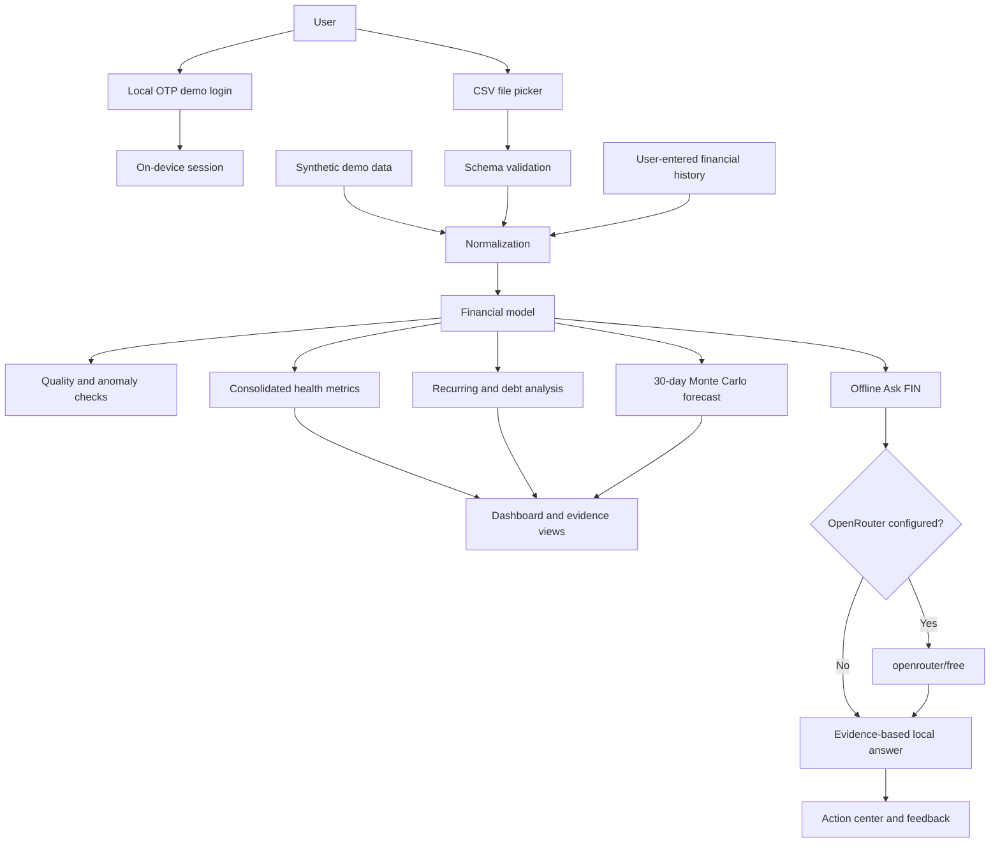

# FIN architecture

FIN is intentionally compact: an Android host provides device integration while an embedded local application renders the interface, evaluates the financial model, and persists prototype state.

## Runtime flow

## Components

| Component | Responsibility |
| --- | --- |
| `MainActivity.java` | Hosts the WebView, configures safe web settings, and opens the Android document picker for CSV import. |
| `index.html` | Contains the responsive interface, local data model, analytics, forecast engine, conversation logic, and persistence. |
| Android resources | Define the launcher icon, theme, app label, and platform configuration. |
| GitHub Actions | Builds a clean debug APK for pushes and pull requests. |

## Data boundaries

- Transactions, corrections, preferences, chat history, and prototype sessions are stored locally.
- No API key is bundled in source code or the APK.
- Optional AI calls contain the question, preferences, and a compact calculated summary; they exclude raw transaction rows.
- Cleartext traffic is disabled in the Android manifest.

## Design trade-offs

The single-asset implementation makes the prototype easy to audit and demo, but a production version should split UI, domain logic, encrypted storage, identity, networking, and automated tests into separate modules. Production authentication should use server-verified OTP, secure token storage, rate limiting, and session revocation.

