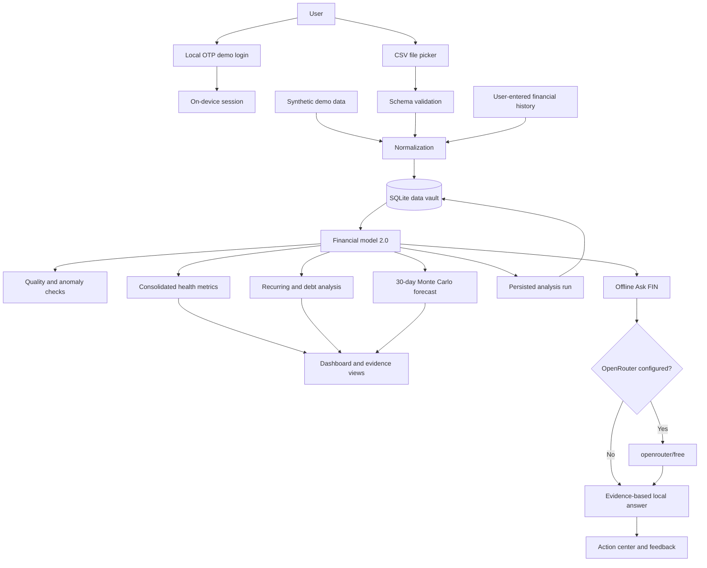

# FIN architecture

FIN is intentionally compact: an Android host provides device integration and durable SQLite storage while an embedded local application renders the interface and evaluates the financial model.

## Runtime flow

## Components

| Component | Responsibility |
| --- | --- |
| `MainActivity.java` | Hosts the WebView, restricts navigation to bundled assets, registers the database bridge, and opens the Android document picker. |
| `FinDatabaseHelper.java` | Owns schema creation, validation, transactions, profile/history persistence, and the capped analysis audit log. |
| `FinDatabaseBridge.java` | Exposes narrow JSON database operations to the bundled interface. |
| `index.html` | Contains the responsive interface, deterministic analytics, forecast engine, and conversation logic. |
| Android resources | Define the launcher icon, theme, app label, and platform configuration. |
| GitHub Actions | Builds a clean debug APK for pushes and pull requests. |

## Data boundaries

- Transactions, financial profile/history, and analysis snapshots are stored in app-private SQLite. Existing local prototype records are migrated on first launch.
- Preferences, correction counters, chat history, and the demo session remain in WebView local storage.
- Android backup is disabled so the financial database is not copied through the platform backup service.
- No API key is bundled in source code or the APK.
- Optional AI calls contain the question, preferences, and a compact calculated summary; they exclude raw transaction rows.
- Cleartext traffic is disabled in the Android manifest.

## Design trade-offs

This release hardens the financial-data and analysis slice, but it is not yet a production identity or banking system. A production version should split UI and domain logic into modules, add encrypted secret storage and user-controlled export/deletion, move provider calls behind a secured backend, and add automated database migration and instrumented Android tests. Authentication still requires server-verified OTP, secure tokens, rate limiting, and session revocation.

